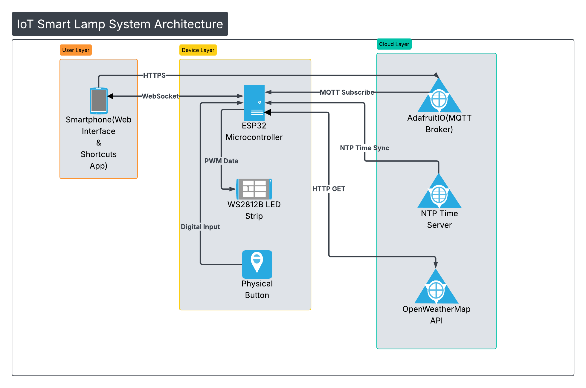

# IoT Smart Presence & Notification Lamp 💡
**A Dual-Core ESP32 System with Real-Time MQTT, WebSockets, and Geofencing.**

## 📖 Project Overview
This project is a connected ambient lighting system designed to maintain presence between two people. Unlike standard smart lights, this device operates on a **decentralized architecture**—it hosts its own asynchronous web server for local control while simultaneously maintaining persistent connections to cloud services for automation.

The system is powered by an **ESP32**, utilizing **FreeRTOS** to handle network stacks (WiFi, MQTT) on Core 0 and animation rendering on Core 1, ensuring zero-latency lighting effects even during heavy network traffic.

## ✨ Key Features
* **📍 Real-Time Geofencing:** Automatically changes state when the user arrives, leaves, or is driving (via iOS Shortcuts & Adafruit IO).
* **⚡ Low-Latency Control:** Uses **WebSockets** for instant UI updates (under 50ms) without page reloads.
* **☁️ Weather Synchronization:** Fetches live weather data from OpenWeatherMap API and renders it as particle animations (Clear, Rain, Snow, Thunderstorm).
* **💓 "Private Pulse" Protocol:** A dedicated MQTT feed allows for sending a "Heartbeat" signal that interrupts current states to display a unique animation.
* **📅 Event Scheduling:** Hard-coded "Special Dates" trigger unique looping animations on birthdays and holidays using NTP time synchronization.

## 🛠️ Technical Stack
* **Microcontroller:** ESP32 Dev Module (C++)
* **Network Protocols:** MQTT (PubSubClient), WebSockets (ESPAsyncWebServer), HTTP (REST API), UDP (NTP).
* **Storage:** LittleFS (On-chip file system) for hosting the Web Dashboard (HTML/CSS/JS).
* **Hardware:** WS2812B Addressable LEDs, Custom 3D Printed Enclosure, 5V Logic Level Shifting.

## ⚙️ System Architecture
The system follows a non-blocking state machine architecture:
1.  **User Layer:** Smartphone communicates via Local WebSocket (Control) or Cloud MQTT (Geofence).
2.  **Cloud Layer:** Adafruit IO acts as the message broker; OpenWeatherMap provides environmental data.
3.  **Device Layer:** The ESP32 parses JSON payloads and updates the LED strip via the RMT peripheral.

## 🚀 Installation & Setup
1.  **Hardware:** Connect WS2812B Data line to GPIO 18 and a Push Button to GPIO 4.
2.  **Filesystem:** Upload the contents of the `/data` folder using the **ESP32 Sketch Data Upload** tool to flash the Web Interface.
3.  **Configuration:**
    * Rename `src/secrets_example.h` to `src/secrets.h`.
    * Enter your WiFi credentials, Adafruit IO Key, and API Keys.
4.  **Flash:** Compile and upload `src/main.ino` using the Arduino IDE.

## 📂 File Structure
* `src/`: Main C++ source code.
* `data/`: Front-end web assets (HTML/CSS/JS) served by the ESP32.
* `docs/`: System diagrams and user manuals.

---
*Built by Juan A. Villagomez - 2026*
